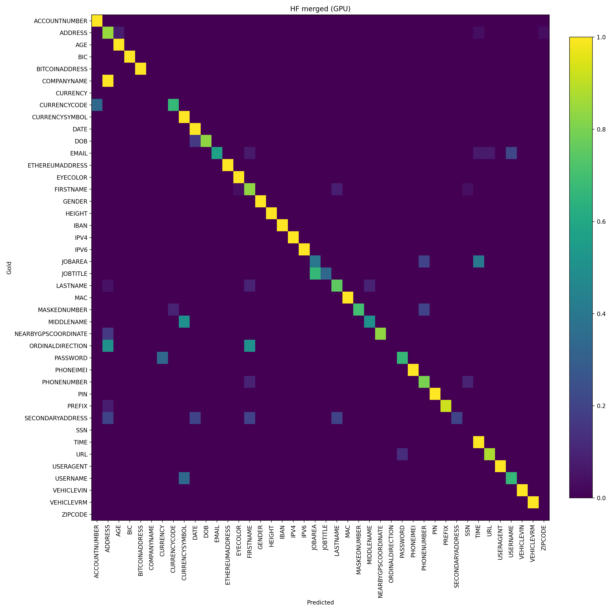
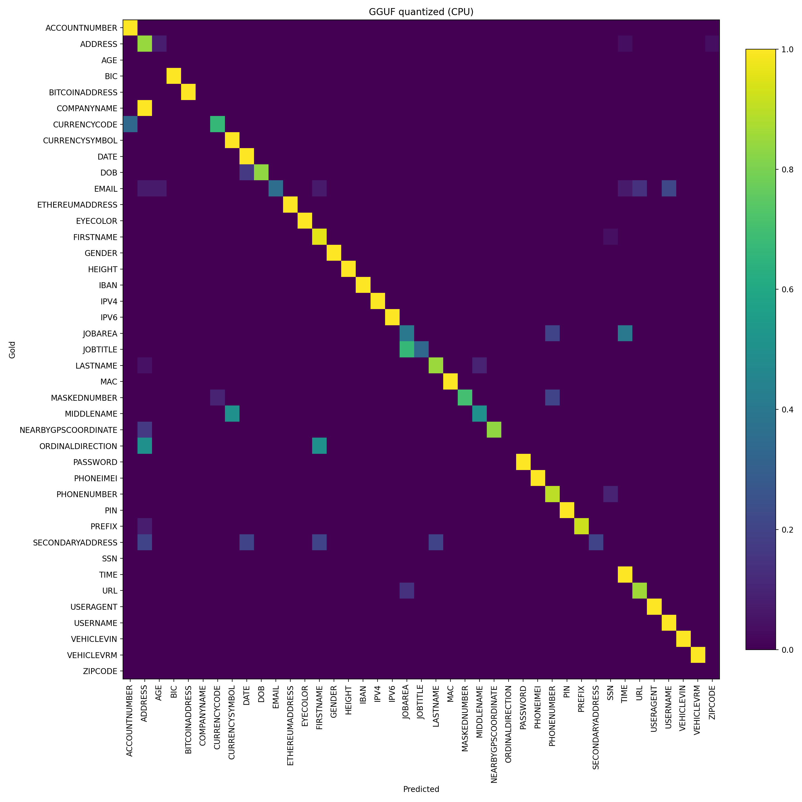

# 🔒 Text Redaction with Mistral-7B

This project fine-tunes [mistralai/Mistral-7B-Instruct-v0.2](https://huggingface.co/mistralai/Mistral-7B-Instruct-v0.2) on the [ai4privacy/pii-masking-200k](https://huggingface.co/datasets/ai4privacy/pii-masking-200k) dataset to **redact sensitive information (PII)** such as names, emails, phone numbers, and addresses.  
It combines **LLM fine-tuning**, **FastAPI-based backend inference**, and a **Gradio web frontend** for real-time text redaction.

🚀 [Live Demo (Quantized Model, Hugging Face Spaces)](https://huggingface.co/spaces/MahdiFalaki/Gradio_pii_mistral7B_instruct-quantized4)

---

## 🚀 Motivation

Handling sensitive data securely is critical in real-world applications. Off-the-shelf LLMs are not optimized for **structured redaction** of personally identifiable information (PII).  
This project delivers an **end-to-end privacy assistant** — from model training to production deployment — demonstrating a practical, lightweight redaction system with CPU-ready inference and post-processing normalization.

---

## 🧱 Architecture Overview

| Layer | Technology | Purpose |
|-------|-------------|----------|
| Model | Mistral-7B-Instruct-v0.2 | Base instruction-tuned LLM |
| Finetuning | Axolotl + LoRA | Task-specific PII masking adaptation |
| Quantization | llama.cpp (GGUF Q4_K_M) | CPU-optimized inference |
| Backend | **FastAPI + Pydantic** | REST API for redaction & normalization |
| Frontend | **Gradio** | Web interface for testing & visualization |
| Deployment | **Docker + Hugging Face Spaces** | Modular containerized deployment |

### System Diagram
```
User ──▶ Gradio Frontend ──HTTP/JSON──▶ FastAPI Backend ─▶ llama.cpp Quantized Model
│
└─────▶ Post-processing (Normalization + Tag Canonicalization)
```
---

## ⚡ Quick Start

0. **Prerequisites**

* A Hugging Face access token for Mistral Model (for How to refere to [How To Get Access HF Tokens](https://huggingface.co/docs/hub/en/security-tokens)).

```
   export HF_TOKEN="hf_XXXXXXXXXXXXXXXXXXXXXXXX"
```

2. **Clone Axolotl**

```
   # Clone Axolotl
   git clone https://github.com/axolotl-ai-cloud/axolotl.git
   cd axolotl/examples
   
   # Clone this repo INTO the examples directory (name it pii_masking)
   git clone https://github.com/MahdiFalaki/LLM-based-PII-Redaction-Tool.git pii_masking
   
   # Work inside the project directory
   cd pii_masking
```

4. **Environment**

```
   conda env create -f environment.yml
```

2. **Preprocess & Train**
 
```
   bash scripts/train/train_full.sh
```

3. **Merge LoRA**

```
   python tools/merge.py
```

4. **Convert & Quantize**

```
   git clone https://github.com/ggerganov/llama.cpp cd llama.cpp && cmake -B build && cmake --build build -j && cd ..
   python llama.cpp/convert_hf_to_gguf.py outputs/pii_masking_mistral/merged_pii_model --outfile merged-gguf/mistral7b-redact-f16.gguf
   llama.cpp/build/bin/quantize merged-gguf/mistral7b-redact-f16.gguf merged-gguf/mistral7b-redact-Q4_K_M.gguf Q4_K_M
```

5. **Inference**

* GPU:
```
   python apps/hf_demo.py
```
* CPU (Quantized GGUF):
```
   python apps/pii_app.py
```

6. **Evaluation**

```
   bash evaluate_100.sh
```

## ✨ Example

```
   * Input: John Smith lives at 123 Main Street, Toronto. His credit card number is 4532 9483 0294 5521.
   * Output: [FIRSTNAME] [LASTNAME] lives at [ADDRESS]. His credit card number is [MASKEDNUMBER].
```
---

## 📊 Results (100 generic unseen samples evaluation)

<table align="center">
  <tr>
    <td align="center" width="50%">
      <br>
      <sub><b>HF Model Confusion Matrix Heatmap</b></sub>
    </td>
    <td align="center" width="50%">
      <br>
      <sub><b>GGUF Model Confusion Matrix Heatmap</b></sub>
    </td>
  </tr>
</table>

--- 

## 🔄 Workflow 

1. **Base Model Selection**

   Use mistralai/Mistral-7B-Instruct-v0.2 as a strong instruction-following base.

2. **Dataset Conversion** Convert ai4privacy/pii-masking-200k into **Alpaca-style JSONL** for Axolotl:
```
   {
     "system": "You are a data privacy assistant.",
     "instruction": "Mask all personally identifiable information in the given text.",
     "input": "John Smith lives at 123 Main Street, Toronto.",
     "output": "[FIRSTNAME] [LASTNAME] lives at [ADDRESS]."
   }
```
3. **Configuration & Finetuning**
   
   Define hyperparameters in config/pii_config.yml and fine-tune with Axolotl.

4. **LoRA Merge**
   
   Merge LoRA adapter weights into the base model to produce a standalone merged model.

5. **Post-Processing**

   * Canonicalize tags (e.g., [Firstname] → [FIRSTNAME])

   * Collapse structured blocks ([BUILDINGNUMBER] [STREET] [CITY] → [ADDRESS])

   * Override credit card patterns if misclassified as phone numbers

   * Reduce tag space for quantized model (e.g., CITY/STATE → [ADDRESS])

6. **Inference**

   * GPU (HF Transformers): run inference on merged model

   * CPU (llama.cpp): convert to GGUF, quantize (Q4_K_M), and run on CPU

7. **Evaluation**
   
   Compare GPU vs CPU outputs on 100 random samples using scripts/eval/run_eval.py. Metrics include confusion matrices and macro Precision/Recall/F1.

--- 

**📂 Repository Layout**

```
${PROJECT_ROOT}

   -- config
     |-- pii_config.yml
     |-- config.py

   -- data
     |-- pii_mask.jsonl -- merged-gguf
     |-- mistral7b-redact-f16.gguf
     |-- mistral7b-redact-Q4_K_M.gguf

   -- scripts

     -- train
       |-- convert_pii_dataset.py
       |-- axolotl_train.py

     -- infer
       |-- gguf_infer.py
       |-- hf_infer.py

     -- eval
       |-- run_eval.py
       |-- metrics.py
       |-- evaluate_100.sh
       |-- data.py

     -- utils
       |-- post_processing.py
       |-- ref_normalize.py
       |-- prompting.py

     -- tools
       |-- convert_to_gguf.sh
       |-- merge.py

   -- compare_cli.py
   -- evaluate_100.sh
```

--- 

## GPU vs CPU Models
   This repository provides two ways to run the model:
   
   * *GPU (HF Transformers, merged model)*
   
     * Best performance (accuracy + speed).
      
     * Requires CUDA and enough VRAM.
      
     * Recommended for production use.
   
   * *CPU (Quantized GGUF via llama.cpp)*
   
     * Lower performance due to quantization + CPU-only execution.
      
     * Enables running the model in lightweight environments.
      
     * Used for the Hugging Face Space demo, which is CPU-only.
   
⚠️ The HF Space demo is much slower and slightly less accurate. For original performance, run the GPU merged model locally instead. The CPU model is for the demo-only.

--- 

## 🛠 Post-Processing Rules

   * *Canonicalize tags* → unify casing/variants

   * *Collapse addresses* → [BUILDINGNUMBER] [STREET] [CITY] → [ADDRESS]

   * *Credit card override* → detect 13–19 digit sequences and normalize to [MASKEDNUMBER]

   * *Reduce tag space* → CITY/STATE → [ADDRESS]

## 🗺 Roadmap

   * [x] Fine-tune on PII dataset
   
   * [x] Merge LoRA → base model
   
   * [x] Quantize with llama.cpp
   
   * [x] Post-processing & normalization

   * [x] HF Space live demo on CPU and local run on GPU
   
   * [x] Eval on 100 samples
   
   

## 🙏 Credits

Dataset: ai4privacy/pii-masking-200k

Base model: mistralai/Mistral-7B-Instruct-v0.2

Tools: Axolotl
, llama.cpp

## 📜 License

MIT License.
